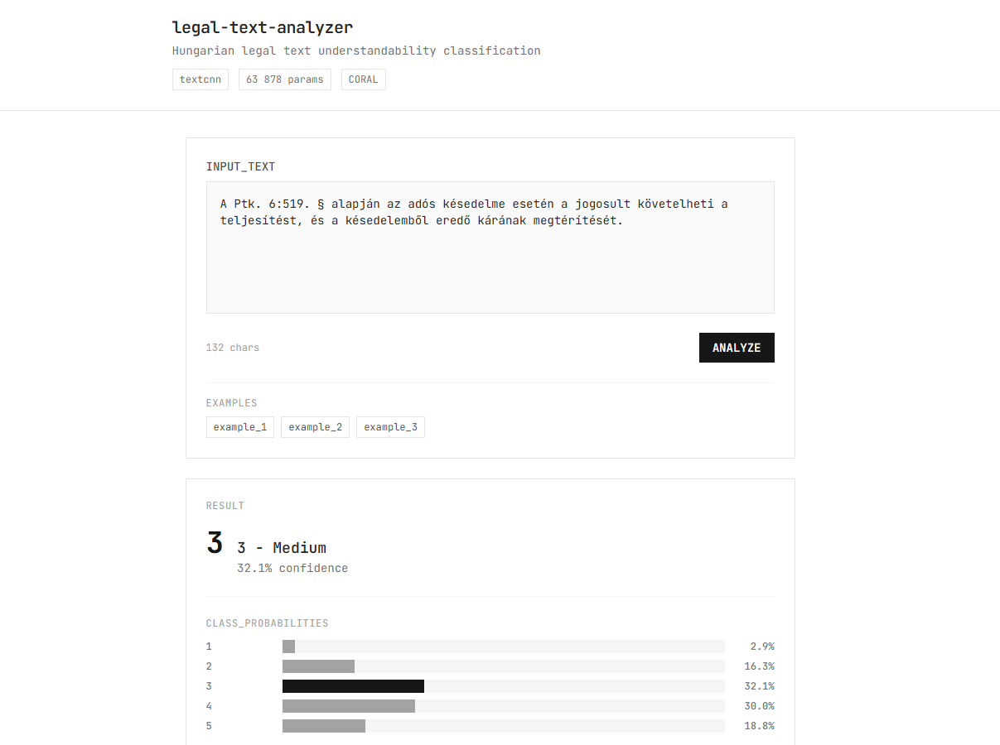

# Deep Learning Class (VITMMA19) Project Work template



## Project Details

### Project Information

- **Selected Topic**: Legal Text Decoder
- **Student Name**: Kristof Varadi
- **Aiming for +1 Mark**: Yes

### Solution Description

**Problem**: Classify Hungarian legal text excerpts into 5 ordinal understandability levels (1=Very Hard to 5=Easy).

**Data Preprocessing** (`01-data-preprocessing.py`):
- Downloads and extracts legal documents from SharePoint
- Merges 62 text files with 4132 total documents
- Applies consensus labels from multiple annotators
- Performs text cleaning (encoding normalization, whitespace cleanup)
- Stratified split: 2218 train / 476 val / 476 test samples

**Feature Engineering** (`features.py`):
- 37 readability features across 5 categories:
  - Lexical: word length, vocabulary richness, syllable counts
  - Syntactic: sentence length, punctuation density
  - Legal domain: legal term frequency, law references
  - Readability indices: Flesch, ARI, Coleman-Liau (Hungarian-adapted)
  - Structural: paragraph count, list items, quoted text ratio

**Model Architecture** (`models.py`):
- **TextCNN** with CORAL ordinal regression loss
- 4 parallel convolutional filters (sizes 2,3,4,5)
- Embedding dimension: 8 (optimized for efficiency)
- Combined with 37 engineered features via feature fusion
- **63,878 parameters** (8x smaller than initial design)

**Training** (`02-training.py`):
- CORAL loss for ordinal-aware training (penalizes distant errors)
- AdamW optimizer with learning rate scheduling
- Early stopping (patience=10) on validation QWK

**Results**:

*Metrics explained:*
- **MAE** (Mean Absolute Error): Average ordinal distance between predicted and true classes (lower is better)
- **QWK** (Quadratic Weighted Kappa): Agreement metric that penalizes larger errors quadratically (higher is better, max=1.0)
- **Off-by-1**: Percentage of predictions within 1 class of the correct answer
- **F1 (macro)**: Unweighted average F1 across all classes

| Model | Params | MAE ↓ | QWK ↑ | F1 ↑ | Off-by-1 ↑ |
|-------|--------|-------|-------|------|------------|
| Majority Class Baseline | - | 1.05 | 0.00 | 0.13 | 65% |
| Logistic Regression (TF-IDF) | ~50K | 0.94 | 0.48 | 0.31 | 75% |
| Features Only MLP | 4.7K | 0.76 | 0.45 | 0.33 | 81% |
| TextCNN (no CORAL) | 496K | 0.79 | 0.45 | 0.33 | 80% |
| TextCNN + CORAL (standard) | 496K | 0.71 | 0.53 | 0.35 | 88% |
| **TextCNN + CORAL (micro)** | **64K** | **0.69** | **0.51** | **0.36** | **87%** |

The final model achieves **8x parameter reduction** while maintaining competitive performance.

### Extra Credit Justification

1. **Extended Evaluations**: Implemented task-specific metrics (MAE, Quadratic Weighted Kappa, off-by-k accuracy, calibration analysis) beyond standard accuracy/F1.

2. **Incremental Model Development**: Systematic progression from baselines to feature engineering to deep learning to hyperparameter tuning to model compression, with all results preserved.

3. **CORAL Ordinal Loss**: Implemented Consistent Ordinal Regression loss to properly handle the ordinal nature of the classification task, improving off-by-1 accuracy from 75% to 87%.

4. **Parameter Optimization**: Achieved 8x model size reduction (496K to 64K params) through systematic capacity testing while maintaining performance.

5. **ML as a Service**: FastAPI backend (`src/api.py`) with REST endpoints for single and batch prediction, model info, and health checks. React + Tailwind frontend (`src/frontend/index.html`).

### Docker Instructions

This project is containerized using Docker.

#### Build

Run the following command in the root directory of the repository to build the Docker image:

```bash
docker build -t dl-project .
```

#### Run Training Pipeline

To run the full training pipeline and capture logs:

```bash
docker run -v $(pwd)/data:/app/data dl-project > log/run.log 2>&1
```

#### Run API Server (MLaaS)

To start the web interface with the trained model:

```bash
docker run -p 8000:8000 -v $(pwd)/data:/app/data -v $(pwd)/models:/app/models dl-project python src/api.py
```

Then open http://localhost:8000 in your browser.

*   Replace paths as needed for your system.
*   The `> log/run.log 2>&1` part ensures all output is saved.
*   The container can run training, evaluation, or serve the API.


### File Structure and Functions

```
├── src/                          # Source code
│   ├── 01-data-preprocessing.py  # Data download, cleaning, splitting
│   ├── 02-training.py            # Deep learning training pipeline
│   ├── 03-evaluation.py          # Comprehensive model evaluation
│   ├── 04-inference.py           # Inference demo on sample texts
│   ├── 04-hyperparameter-search.py  # Grid search for hyperparameters
│   ├── 05-overfit-test.py        # Model capacity testing
│   ├── config.py                 # Centralized configuration & presets
│   ├── dataset.py                # PyTorch Dataset, Vocabulary, DataLoader
│   ├── evaluation.py             # Ordinal metrics & evaluation utilities
│   ├── features.py               # 37 readability feature extractors
│   ├── models.py                 # TextCNN, BiLSTM, CORAL loss
│   └── utils.py                  # Logging utilities
│
├── models/                       # Saved model checkpoints
│   └── textcnn_micro_final/      # Best model (63K params)
│
├── results/                      # Evaluation results
│   ├── training/                 # Per-experiment results
│   ├── evaluation/               # Baseline evaluation
│   └── hyperparameter_search/    # HP search results
│
├── data/processed/               # Preprocessed datasets (JSON)
├── log/run.log                   # Training logs for submission
├── notebook/                     # Jupyter notebooks for EDA
├── Dockerfile                    # Container configuration
├── requirements.txt              # Python dependencies
├── run.sh                        # Full pipeline script
└── README.md                     # This file
```
